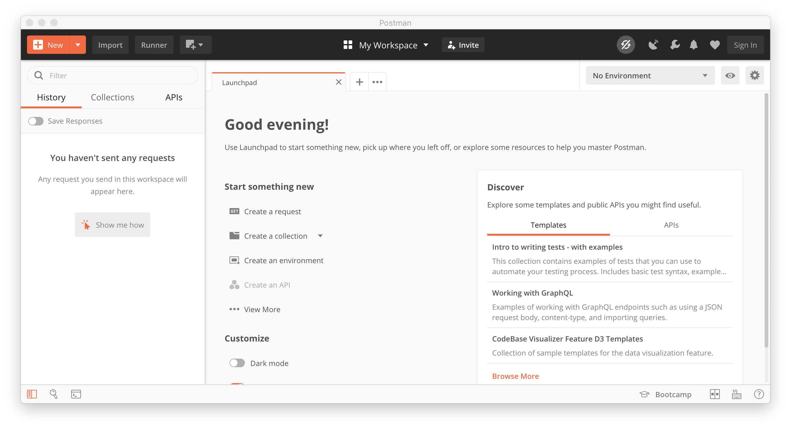

# Install Postman

## Download

[Download](https://www.postman.com/downloads/) and install Postman by following
the installation instructions.

## Start Postman without creating an account

Postman is able to sync your requests across multiple devices. For this to work
you are able to log in to Postman with an account.

In case you dont want to store your company requests on the Postman server or just
want to try the app you can use Postman without an account.

To start without an account click the 
``Sign in / Sign up through email instead`` link.

It will change to:

Clicking it again will bring you straight to the app.

