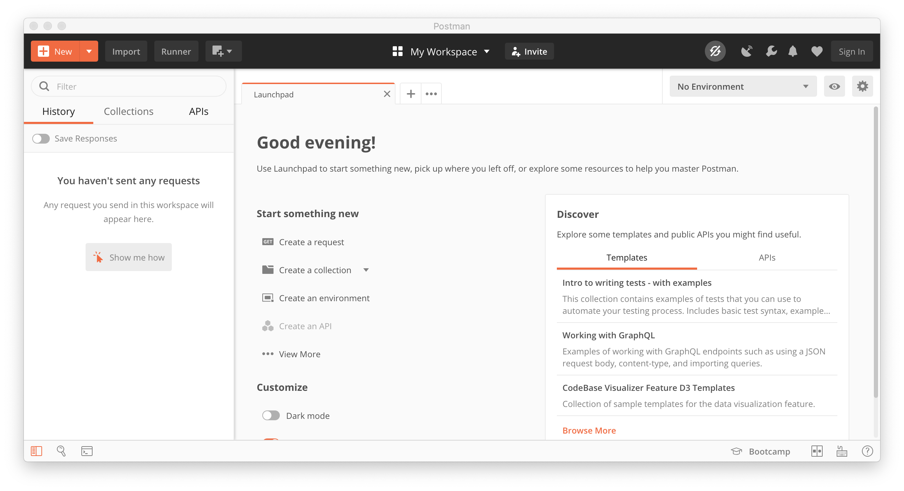
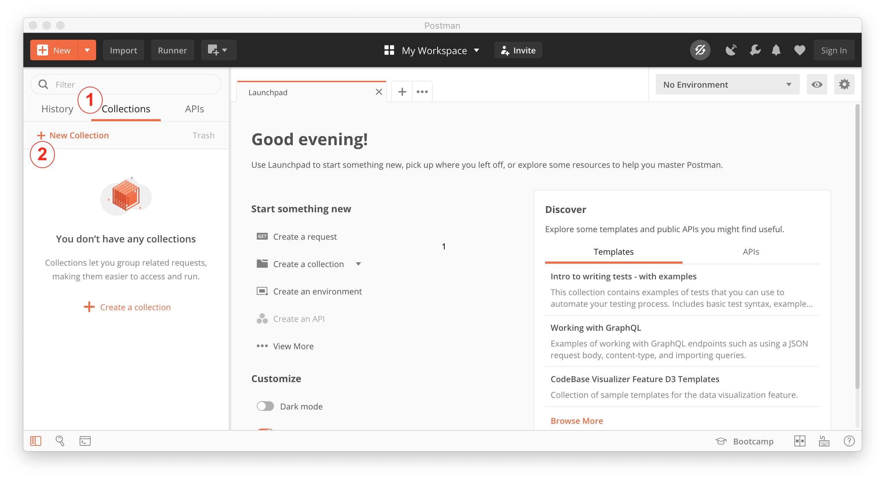
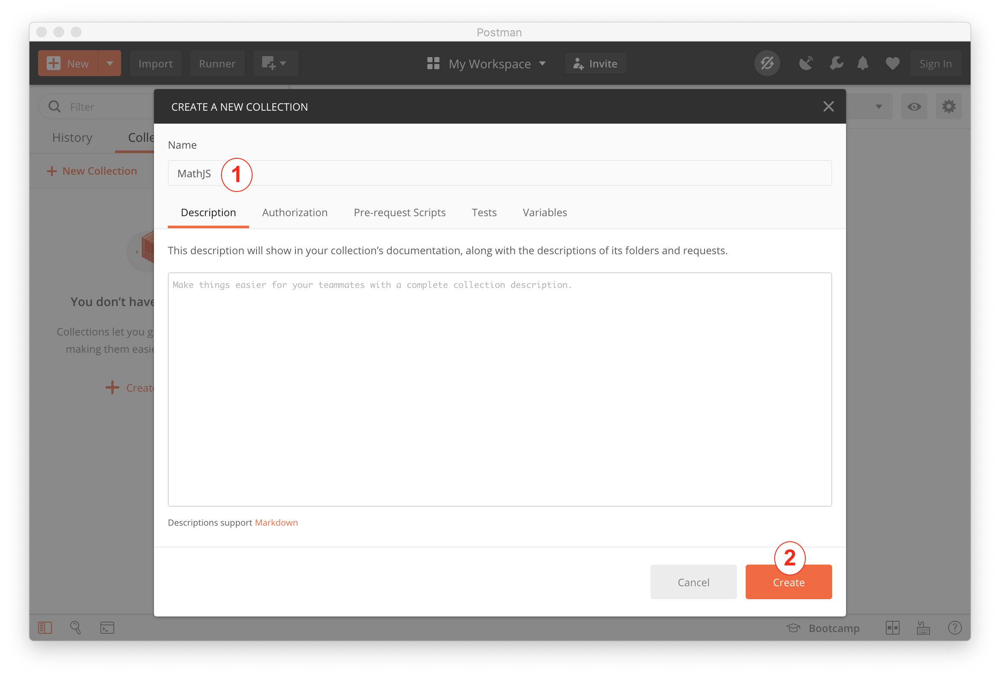
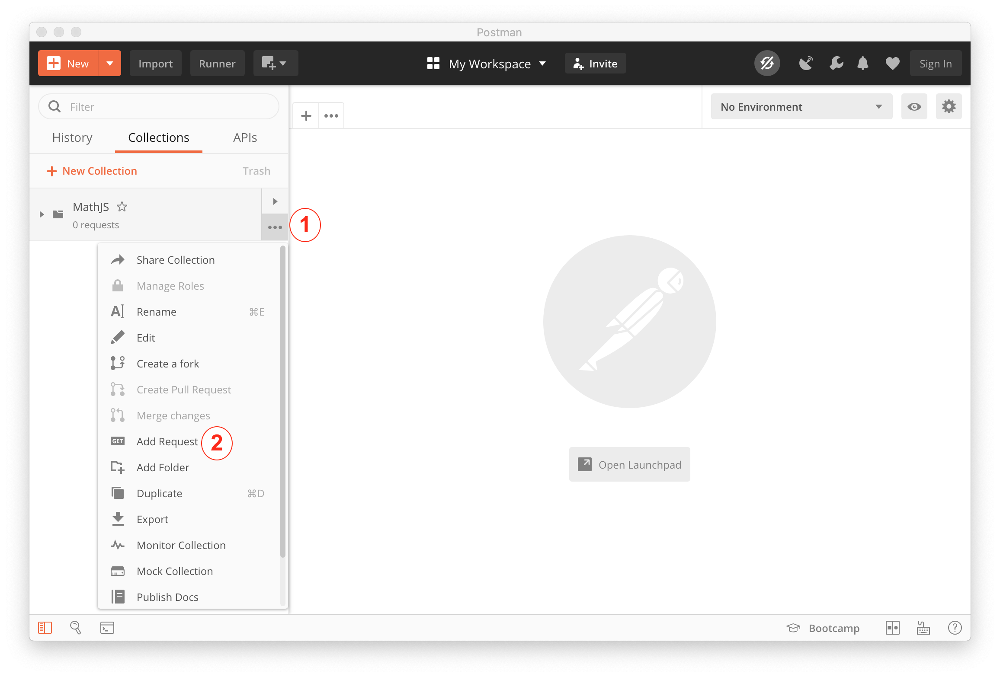
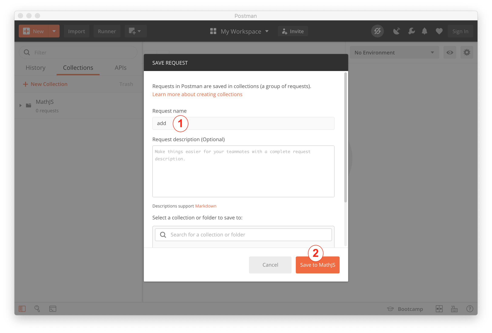
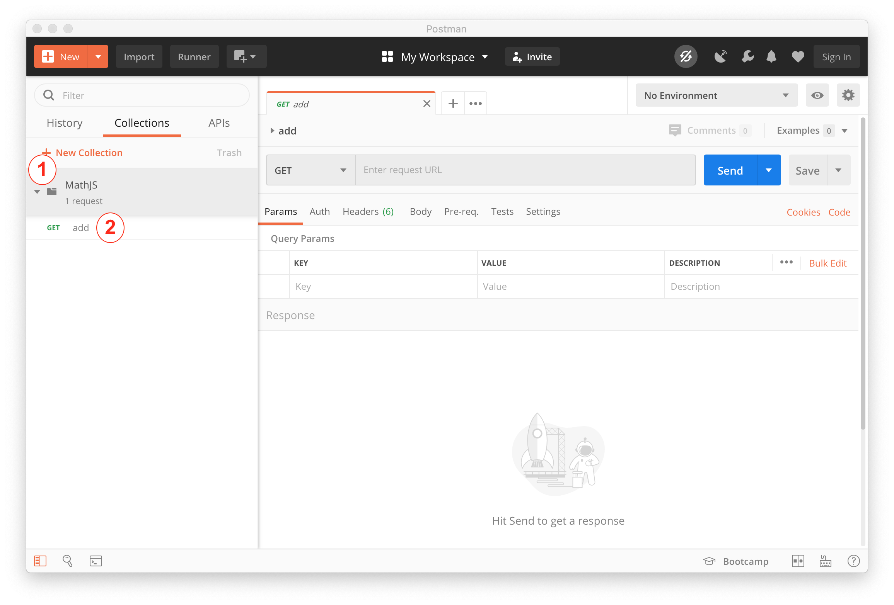
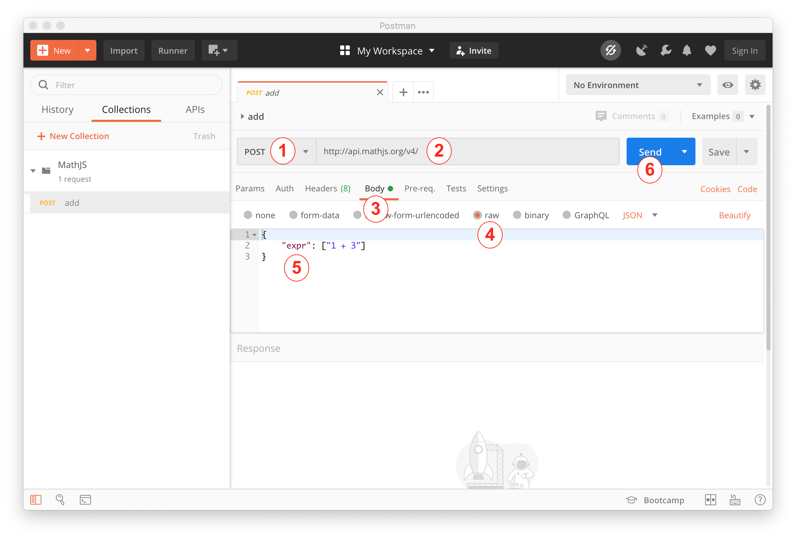
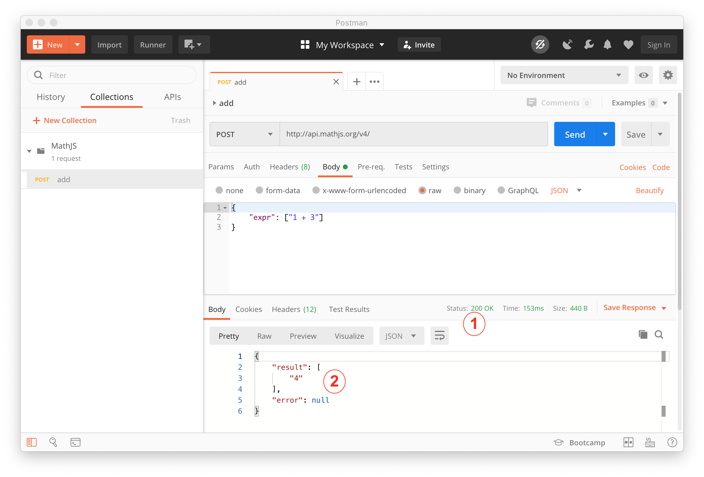

# Create your first Request with Postman

As the calculator example is always a good start, our request will use the MathJS
API to add the numbers 1 and 3.

## Create a Collection

After starting your fresh Postman installation you should see something like this:



The first thing we will do is to create a collection. A Collection organizes your
request across different projects. For a detailed overview on collections see the 
[Creating Collections](https://learning.postman.com/docs/postman/collections/creating-collections/)
section in the Postman learning center.

1. Click the Collections tab
1. Click the "New Collection" button



1. enter the collections name and
2. create the collection



Now your newly created collection should appear on the left navigation bar.

## Create the Request

Now its time to create the actual REST request.

1. Click the "..." menu button on the collection element
1. Add a Request to the collection



1. enter the name of the request
    1. as we are going to add two numbers name the request "add"
2. save the request by clicking on the save to MathJS button 




If the new request is not displayed

1. expand the collection with the little arrow icon and
2. select the request to display the requests configuration screen 




## Customize and Send the Request


1. Select the POST method from the drop down list
    1. a POST request can send data to a server
2. enter the url ``http://api.mathjs.org/v4/`` into the url field
3. Select the "Body" tab
4. Select the "raw" tab
5. enter the following content into the body text area
    ````json
    {
       "expr": ["1 + 3"]
    }
    ````
6. Send the request by clicking the "Send" button




## Check the Result

1. Check the requests status code, it should be 200 meaning OK
2. Check the result, it should contain the result of the calculation and an 
optional error message 



Congratulations!

You executed your first result REST request.