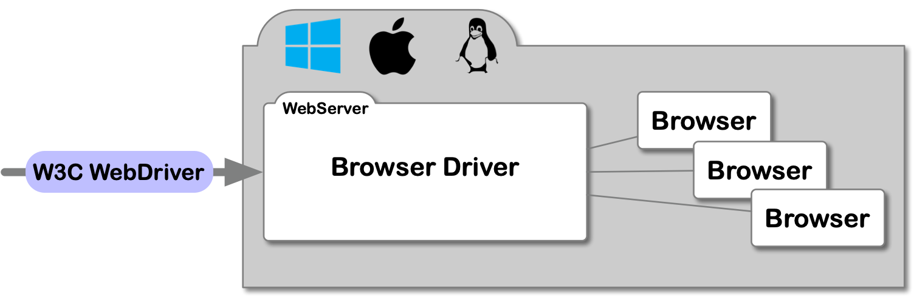
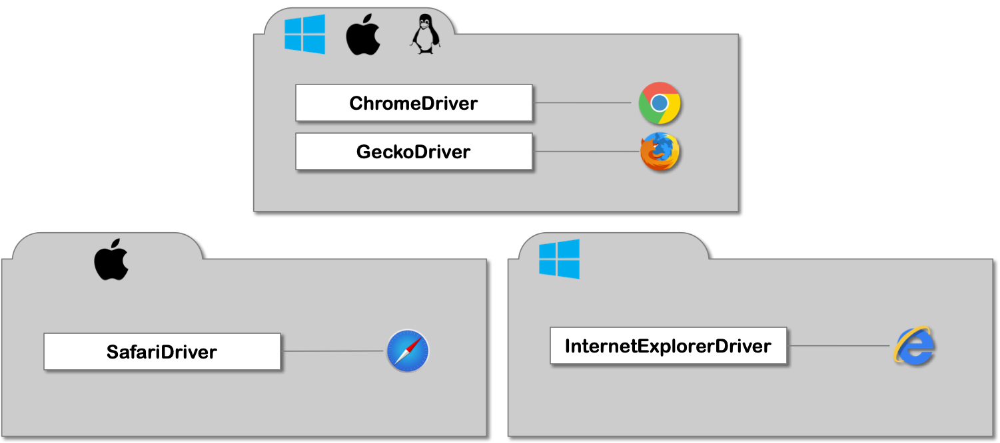
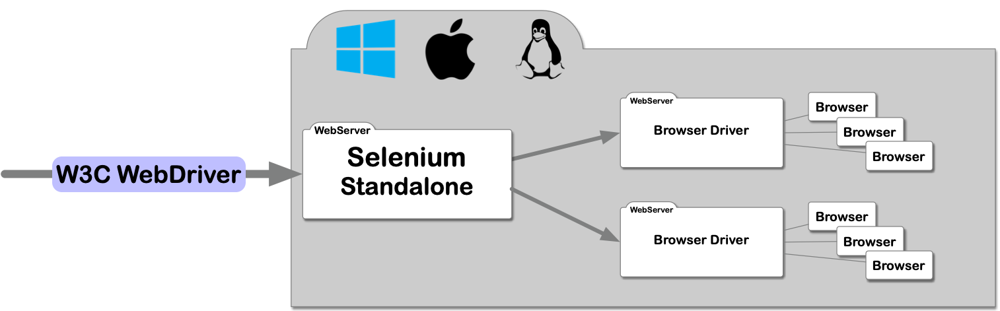
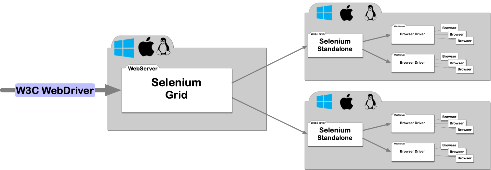
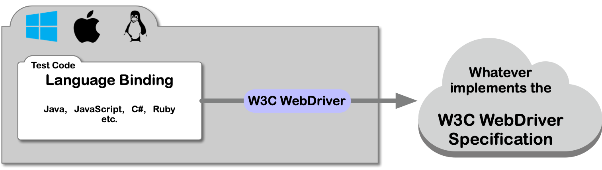

# Selenium Fundamentals

Knowing the basic building blocks of a Selenium based test environment is essential to understand a 
variety of test and configuration problems. The Selenium eco system consists of several parts like

* Browser Driver
* Selenium Standalone or Grid
* Language Binding or
* the W3C WebDriver Specification

In the following sections we are going to cover each of listed parts in detail.

The Selenium IDE is a separate topic and is not covered here.  

## A little bit of History

## W3C WebDriver Specification

If you are reading about Selenium sooner or later you will come across the terms 
[JSON Wire Protocol](https://github.com/SeleniumHQ/selenium/wiki/JsonWireProtocol) 
or [W3C WebDriver](https://www.w3.org/TR/webdriver/) (protocol, specification, interface). 

The W3C WebDriver specification is the latest definition of the interface allowing you to control
User Agents (Browsers ... Desktop and Mobile) and introspect the status of those agents. It specifies
several [REST endpoints](https://www.w3.org/TR/webdriver/#endpoints) which are independent of any
programming language. It will be primarily used by QAs to write automated user agent tests.

The JSON Wire Protocol is the predecessor of the W3C WebDriver specification where the latter reuses a 
great part of the original specification. The W3C WebDriver specification was accepted by the W3C consortium and 
is now the standard for all future selenium implementations. 

## Browser Driver

The browser driver is the first building block which is implementing the W3C WebDriver specification. 
It is directly controlling and communicating with the browser itself. Every browser has its own browser driver
implementation and the driver is the only application in the automation process which has access to the browser
instance.

A Client is now able to use the W3C WebDriver interface to communicate with the browser driver and control the
behaviour and query the status of a browser.

By implementing the W3C WebDriver specification the browser driver is a simple web server a client can talk to.

As I mentioned earlier every browser has its own browser driver. So there are for example:

* chromedriver (Googles Chrome browser)
* geckodriver (Mozillas Firefox browser)
* IEDriverServer (Microsofts Internet Explorer driver)
* safaridriver (Apples Safari browser)

There are driver implementations for other browsers as well, I just named the most common browser.

The problem in testing different browsers is, that you can't start them on a single machine. Apples Safari is 
only running on MacOS and Microsofts Internet Explorer is just available on Windows and the browser driver is
just available for the same OS.

Chrome and Firefox on the other hand are available on all three major OSes (Windows, Linux, MacOS) and browser
driver are provided for those systems. 

## Selenium Standalone

Testing your web app means checking it on multiple browsers as each browser displays the site a bit differently. 
If you just rely on the browser driver, you would have to change your test configuration in case a different 
browser has to be tested.

Selenium now bridges this gap and provides a uniform way of testing on different browsers. Selenium can start
and stop the browser driver and relays the incoming requests to it. Selenium itself is implementing the 
W3C WebDriver specification so for a Client its transparent to which app it is talking to.

In addition Selenium takes over some administration work as:

* keep track of running tests on each browser driver
* limit the number of browser which can be started on each browser driver
* limit the number of parallel test session

To explain those features in more detail just imagine the following configuration

* available browsers: chrome and firefox (so it has the chromedriver and geckodriver configured)
* max number of chrome browsers to run: 2
* max numbers of firefox browser to run: 3
* max total parallel sessions to run 3

The max parallel session is set to three so it can execute:

* 2 chrome (because it can just start 2 chrome)
* 3 firefox (it can max out the parallel sessions as max number of firefox browser is set to 3 as well)
* 2 chome and 1 firefox
* 1 chome and 2 firefox
* and all other combination where less than 3 browsers are started
 

## Selenium Grid

Selenium Standalone can just use the browser driver and execute browser on the same machine. What do you do if
you want to test your web app on Safari, Chrome and Internet Explorer?

In this case you would need at least 2 different machines (MacOS and Windows) as Safari is just running on 
MacOS and the Internet Explorer is just running on Windows.

To Facilitate your cross browser testing Selenium Grid comes to the rescue.

Selenium Grid itself is nothing more than The Selenium Standalone server started in **GRID MODE**. 

After you started your Selenium Grid server you can start multiple Selenium Standalone server in 
**NODE MODE** on other machines and register them to the grid. The Selenium Node specifies how many browsers
can be started on the machine and communicates this to the Grid server.

This architecture allows you to grab any machine possible in your test environment and configure to run browser
tests. If you have for example ten small machines which are just able to run two browser each in parallel because the 
RAM and CPU on those machines is limited, you can set the max session number to two and the total grid now has
the ability to run 20 browsers tests in parallel. Or you can mix Windows, MacOS and Linux machines so you can 
test each possible combination of OS and browser type on your grid.

As the Selenium Grid is just the Selenium Standalone in **GRID MODE** which is implementing 
the W3C WebDriver specification its completely transparent to a client if it talks to a browser driver, 
the Selenium Standalone or a Selenium Grid.   

## Language Binding

W3C WebDriver Language Bindings allow you to interact with Selenium (Standalone, Grid) or the Browser Driver
in whatever language you like. The official supported language bindings are:

* Java
* JavaScript (Node.js)
* C#
* Ruby
* Python

There are language bindings for other languages as well but they are not officially supported but might run
as good as the former mentioned bindings.

