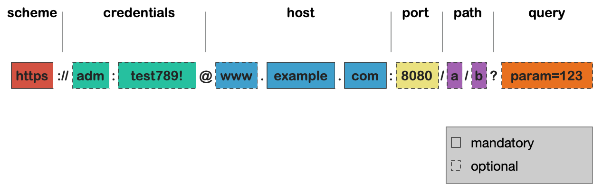
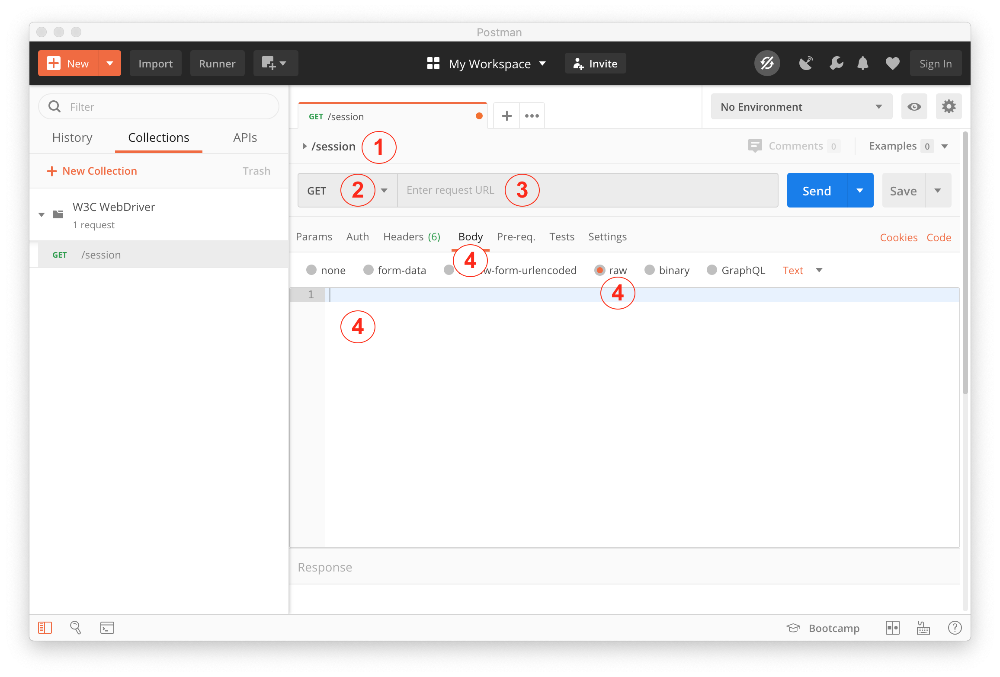

# Test Automation with the W3C WebDriver Protocol

To understand the Selenium its best to use the tool with its own API, the 
[W3C WebDriver specification](https://w3c.github.io/webdriver/). For the following examples you don't need 
an in depth knowledge of the specification. This sections intends to demonstrate how web test automation works
with Selenium on its basic level without the use of a programming languages like JAVA, Ruby or JavaScript.

## Short intro to REST

We are not going into the details of the **RE**presentational **S**tate **T**ransfer (**REST**) as there will 
be a separate tutorial about it. But to understand Selenium we need some basic knowledge about it.

### Client / Server

The first principle of REST is the separation into a client and a server.


Client and Server dont know about each other and can be implemented independently. A client just knows the 
format of the message (or request) it can send to the server and the server knows the format of the response
it is required to send so that the client will be able to process it. 

The most common example is the communication between a browser and a web server. 


If a browser wants to display a the google search page, it is sending a request (in this case a GET request) to
the google server and when everything is alright the google server sends back a status (OK or NOK) and the page
itself the browser is now able to interpret and display.

### Methods

To indicate what the client intends the server to do it can use several methods:

* GET - the client just wants information from the server
* POST - the client sends information to server with the intend to create something
    * e.g the server shall create a user and the client provides user name and password
* DELETE - the clients wants to delete something on the server
    * e.g. delete the before mentioned user on the server

### URL

To indicate which server to contact and what information should be processed the client uses a URL,
which consists of the following parts:



* scheme - defines the protocol to use (e.g http, https, file [etc.](https://en.wikipedia.org/wiki/List_of_URI_schemes))
* credentials - specify if there is a basic authentication used to access this resource
* host - defines which unique server to contact
* port - is the docking point to on the server (for http its 80 and for https its 443)
* path - defines which resource to query (could be a folder on the server or any other kind of resource)
* query - specifies some filter criteria to apply when querying the resource

So contacting ``https://www.google.com`` means:

1. do an encrypted web transfer
1. from the www.google.com server
1. on port 443 (it is the standard for https and can be omitted)
1. and query the root (/) path, where the slash (/) can be omitted as the root path is the default when nothing is specified 

## Prerequisites

Please make sure you have [Postman](https://www.postman.com/downloads/) and 
[Selenium](../000_Install_Selenium/Install_Selenium.md#manual-installation-by-downloading-the-server-and-driver-files) 
installed with its Firefox and Chrome Drivers.

Throughout this lesson we are using Postman to execute REST requests. If you are not familiar with 
Postman please follow the [installation instructions](../../postman/000_Install_Postman/Install_Postman.md)
and get familiar with the app by
[creating your first request](../../postman/010_Create_your_First_Request/CREATE_YOUR_FIRST_REQUEST.md).

To not litter the documentation with screenshots I will use the following template for request creation:



1. NAME - enter the name in field 1
1. METHOD - select the given method from the drop down
1. URL - enter the given URL into the URL field
1. BODY - if a body is necessary do the follwing:
    1. select the body tab
    1. select the raw tab
    1. enter the given body into the body field

## Start the Chrome Driver

As we are going to demonstrate web test automation with Chrome we need to start the chromedriver.

Go to you Selenium folder and check if the chrome driver is available. The directory structure should look like:

````text
├─ chromedriver.exe
├─ geckodriver.exe
├─ selenium-server-standalone.jar
````

Starting the driver with

````powershell
./chromedriver.exe
````

should lead to the following output:

````text
Starting ChromeDriver <VERSION INFO> on port 9515
Only local connections are allowed.
Please protect ports used by ChromeDriver and related test frameworks to prevent access by malicious code.
````

Now Chrome Driver is started at port ``9515`` and is ready to use. Please remember the port information as we need it in
the following sections.

## Start the Browser

The first request we create will start the browser instance.

1. ``/session``
2. ``POST``
3.  ``http://localhost:9515/session``
4. Body:
    ````json
    {
        "desiredCapabilities": {
           "browsername": "chrome"
        }
    }
    ````

Send the request by pressing the SEND button. A browser should come up (sometime it takes a while) and you
should see the following response:

````json
{
    "sessionId": "77777777777777777777777",
    "status": 0,
    "value": {
        "acceptInsecureCerts": false,
        "acceptSslCerts": false,
        "applicationCacheEnabled": false,
        "browserConnectionEnabled": false,
        "browserName": "chrome",
        "chrome": {
            "chromedriverVersion": "80.0.3987.106 (f68069574609230cf9b635cd784cfb1bf81bb53a-refs/branch-heads/3987@{#882})",
            "userDataDir": "YOUR LOCAL DATA FOLDER"
        },
        "cssSelectorsEnabled": true,
        "databaseEnabled": false,
        "goog:chromeOptions": {
            "debuggerAddress": "localhost:53509"
        },
        "handlesAlerts": true,
        "hasTouchScreen": false,
        "javascriptEnabled": true,
        "locationContextEnabled": true,
        "mobileEmulationEnabled": false,
        "nativeEvents": true,
        "networkConnectionEnabled": false,
        "pageLoadStrategy": "normal",
        "platform": "Windows",
        "proxy": {},
        "rotatable": false,
        "setWindowRect": true,
        "strictFileInteractability": false,
        "takesHeapSnapshot": true,
        "takesScreenshot": true,
        "timeouts": {
            "implicit": 0,
            "pageLoad": 300000,
            "script": 30000
        },
        "unexpectedAlertBehaviour": "ignore",
        "version": "80.0.3987.122",
        "webStorageEnabled": true
    }
}
````

The response contains some useful information about the started browser like the browser version and the platform.

The most imported information we will use now is the ``sessionId``. It identifies the browser you want to control.

## Load Google Search

Now we are going to load the search page in the opend browser.

Create a new request with the following data:

1. ``/session/:SessionId/url``
1. POST
1. ``http://localhost:9515/session/77777777777777777777777/url``
    * please replace the ``77777777777777777777777`` with the sessionId from the last request
1. Body:
   ````json
   {
   	"url": "https://www.google.com"
   }
   ````

After sending the request with the SEND button the response should be something like:

````json
{
    "sessionId": "77777777777777777777777",
    "status": 0,
    "value": null
}
````

## Enter the Search Text

After we opened the search page we want to search something. We need to enter the search text into the search field.

For this to happen we have to execute two requests:

1. Identify and locate the search field
2. Enter the text into the field 

**Identify the Input Field**

Create a new request with the following data:

1. ``/session/:SessionId/element (search field)``
1. POST
1. ``http://localhost:9515/session/77777777777777777777777/element``
    * please replace the ``77777777777777777777777`` with the sessionId from the first request
1. Body:
    ````json
    {
        "using": "name",
        "value": "q"
    }
    ````

The request should return a unique element ID which will be used in the next request to enter the search text.

````json
{
    "sessionId": "77777777777777777777777",
    "status": 0,
    "value": {
        "ELEMENT": "0.1111111111111111-2"
    }
}
````

**Enter the Text**

To enter the text into the field we need a new request with:

1. ``/session/:SessionId/element/:ElementId/value``
1. POST
1. ``http://localhost:9515/session/77777777777777777777777/element/0.1111111111111111-2/value``
    * please replace the ``77777777777777777777777`` with the sessionId from the first request
    * please replace the ``0.1111111111111111-2`` with the elementId from the last request
1. Body:
    ````json
    {
        "value":["software test automation"]
    }
    ````

Sending the request should enter the text into the search field and should return the following response:

````json
{
    "sessionId": "77777777777777777777777",
    "status": 0,
    "value": null
}
````


## Click the Search Button

To actually search for the given text we need to submit the search be pressing the search button.

The process is again split into two parts:

1. Identify and locate the Search Button
2. Click the Button

**Identify the Search Button**

Create a new request with the following data

1. ``/session/:SessionId/element``
1. POST
1. ``http://localhost:9515/session/77777777777777777777777/element``
    * please replace the ``77777777777777777777777`` with the sessionId from the first request
1. Body:
    ````json
    {
        "using":"name",
        "value":"btnK"
    }
    ````

The result now contains again the elementId (here: "0.2222222222222222-2")

````json
{
    "sessionId": "77777777777777777777777",
    "status": 0,
    "value": {
        "ELEMENT": "0.2222222222222222-2"
    }
}
````

**Click the Search Button**

Create a new request with:

1. ``/session/:SessionId/element/:ElementId/click``
1. POST
1. ``http://localhost:9515/session/77777777777777777777777/element/0.2222222222222222-2/click``
1. Body
    ````json
    ````

Sending the request will click on the button and the search links should appear on the google search field

````json
{
    "sessionId": "77777777777777777777777",
    "status": 0,
    "value": null
}
````